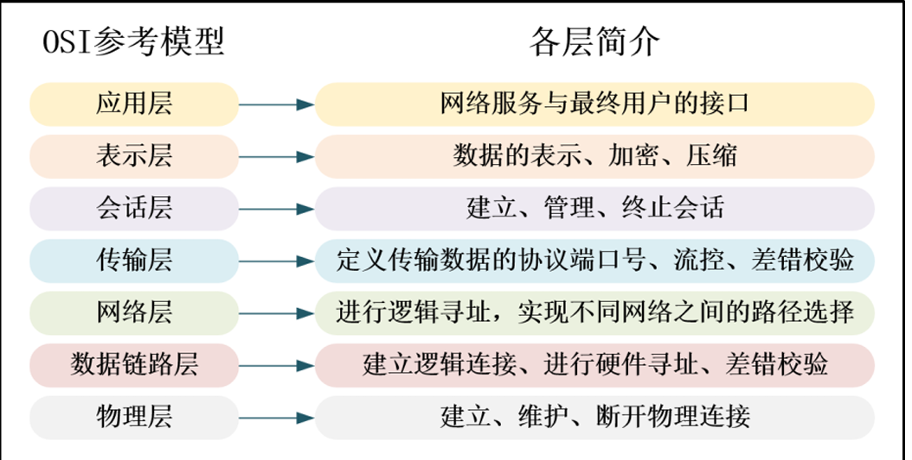
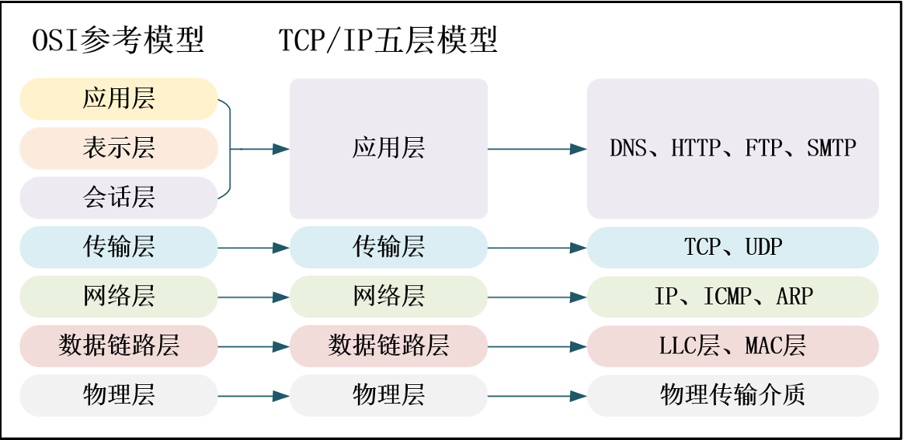
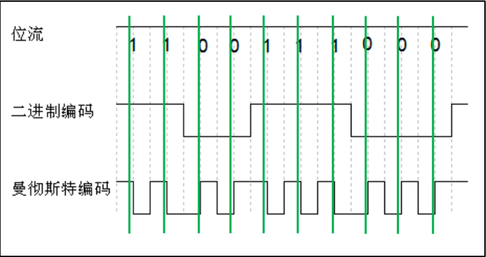
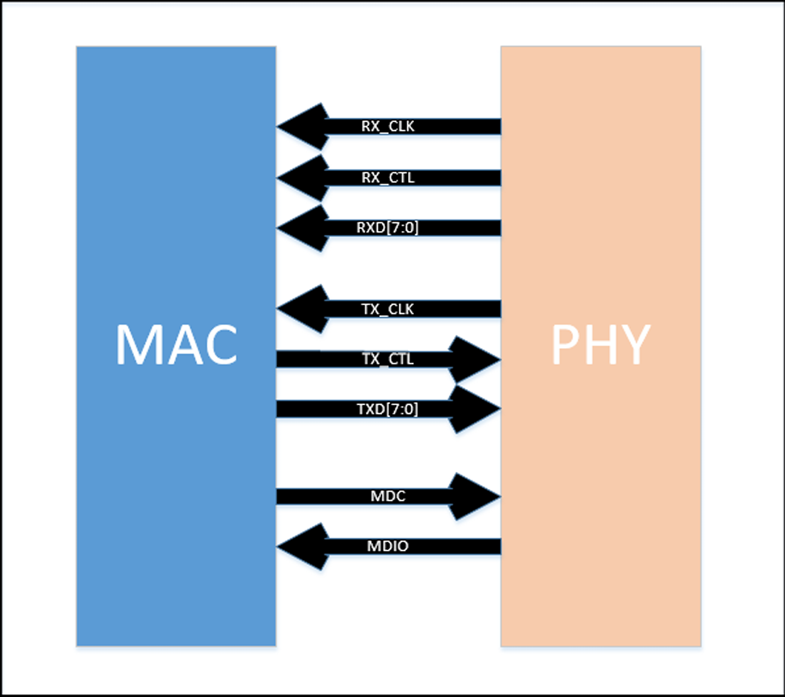
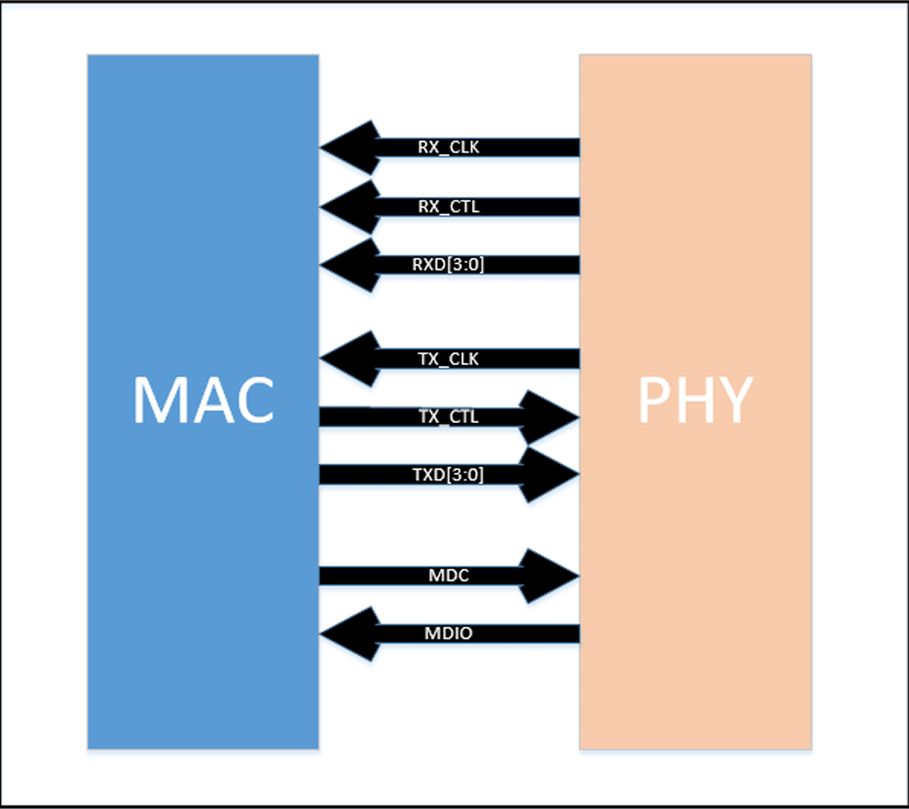
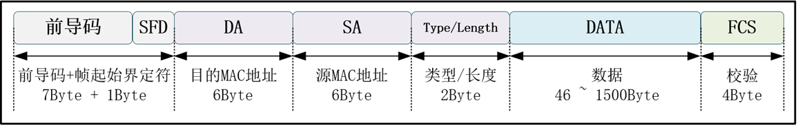
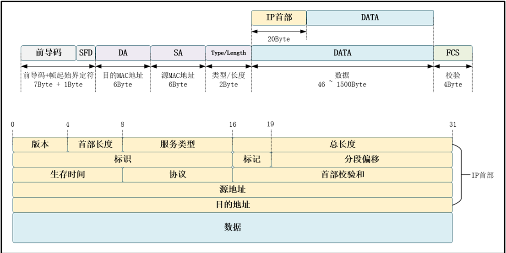
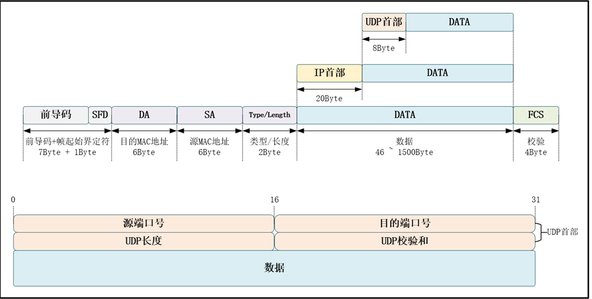
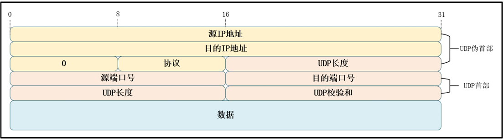
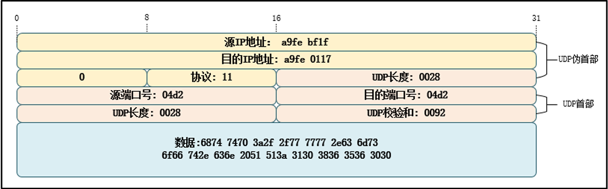

# Verilog Design For FPGA

## latch
1. 组合逻辑中if语句没有else；  
2. 组合逻辑中case的条件不能够完全列举时且不写default；  
3. 组合逻辑中输出变量赋值给自己。  

## 阻塞赋值与非阻塞赋值
（1）在编写时序逻辑的代码时采用非阻塞赋值的方式   
（2）使用always块来编写组合逻辑的代码时要用阻塞赋值的方式  
（3）在同一个always块中不要既要用非阻塞赋值又用阻塞方式赋值  
（4）虽然锁存器电路建模是我们不推荐的，但是如果使用到要采用非阻塞赋值的方
式。   
使用非阻塞赋值实现时序逻辑，实现锁存器是最为安全的。  
（5）一个always块只一个变量进行赋值  

## 状态机 FSM（Finite State Machine）
```verilog
// vending-machine
// 2 yuan for a bottle of drink
// only 2 coins supported: 5 jiao and 1 yuan
// finish the function of selling and changing

module  vending_machine_p3  (
    input           clk ,
    input           rstn ,
    input [1:0]     coin ,     //01 for 0.5 jiao, 10 for 1 yuan

    output [1:0]    change ,
    output          sell    //output the drink
    );

    //machine state decode
    parameter            IDLE   = 3'd0 ;
    parameter            GET05  = 3'd1 ;
    parameter            GET10  = 3'd2 ;
    parameter            GET15  = 3'd3 ;

    //machine variable
    reg [2:0]            st_next ;
    reg [2:0]            st_cur ;

    //(1) state transfer
    always @(posedge clk or negedge rstn) begin
        if (!rstn) begin
            st_cur      <= 'b0 ;
        end
        else begin
            st_cur      <= st_next ;
        end
    end

    //(2) state switch, using block assignment for combination-logic
    //all case items need to be displayed completely    
    always @(*) begin 
        //st_next = st_cur ;//如果条件选项考虑不全，可以赋初值消除latch
        case(st_cur)
            IDLE:
                case (coin)
                    2'b01:     st_next = GET05 ;
                    2'b10:     st_next = GET10 ;
                    default:   st_next = IDLE ;
                endcase
            GET05:
                case (coin)
                    2'b01:     st_next = GET10 ;
                    2'b10:     st_next = GET15 ;
                    default:   st_next = GET05 ;
                endcase

            GET10:
                case (coin)
                    2'b01:     st_next = GET15 ;
                    2'b10:     st_next = IDLE ;
                    default:   st_next = GET10 ;
                endcase
            GET15:
                case (coin)
                    2'b01,2'b10:
                               st_next = IDLE ;
                    default:   st_next = GET15 ;
                endcase
            default:    st_next = IDLE ;
        endcase
    end

    //(3) output logic, using non-block assignment
    reg  [1:0]   change_r ;
    reg          sell_r ;
    always @(posedge clk or negedge rstn) begin
        if (!rstn) begin
            change_r       <= 2'b0 ;
            sell_r         <= 1'b0 ;
        end
        else if ((st_cur == GET15 && coin ==2'h1)
               || (st_cur == GET10 && coin ==2'd2)) begin
            change_r       <= 2'b0 ;
            sell_r         <= 1'b1 ;
        end
        else if (st_cur == GET15 && coin == 2'h2) begin
            change_r       <= 2'b1 ;
            sell_r         <= 1'b1 ;
        end
        else begin
            change_r       <= 2'b0 ;
            sell_r         <= 1'b0 ;
        end
    end
    assign       sell    = sell_r ;
    assign       change  = change_r ;

endmodule
```


## 互联网

### OSI模型

为了实现网络通信的标准化，普及网络应用，国际标准化组织(ISO)将整个以太网通信
结构制定了 OSI (Open System Interconnection)模型，译为开放式系统互联。 
OSI 定义了网络互连的七层框架（物理层、数据链路层、网络层、传输层、会话层、
表示层、应用层），即 OSI 开放互连系统参考模型。每个层功能不同，网络通信中各司其
职，整个模型包括硬件和软件定义。 OSI 模型只是是理想分层，一般的网络系统只是涉及
其中几层。OSI参考模型，具体见图  
  
应用层：OSI 参考模型中最靠近用户的一层，为计算机用户提供应用接口和各种网
络服务。主要协议：HTTP，HTTPS，FTP，POP3、SMTP、SNMP、DHCP、
DNS。  
 表示层：表示层提供各种用于应用层数据的编码和转换功能，确保一个系统的应用
层发送的数据能被另一个系统的应用层识别。如果必要，该层可提供一种标准表
示形式，用于将计算机内部的多种数据格式转换成通信中采用的标准表示形式。
同时，数据压缩和加密也是表示层可提供的转换功能之一。主要格式：JPEG、
ASCll、DECOIC、加密格式。  
 会话层：会话层就是负责建立、管理和终止表示层实体之间的通信会话。该层的通
信由不同设备中的应用程序之间的服务请求和响应组成。 
 传输层：传输层的作用是为上层协议提供端到端的可靠和透明的数据传输服务，包
括处理差错控制和流量控制等问题。该层向高层屏蔽了下层数据通信的细节，使
高层用户看到的只是在两个传输实体间的一条主机到主机的、可由用户控制和设
定的、可靠的数据通路。主要协议TCP、UDP。  
 网络层：网络层通过 IP 寻址来建立两个节点之间的连接，为源端的运输层送来的
分组，选择合适的路由和交换节点，正确无误地按照地址传送给目的端的传输
层，就是我们常说的IP层。主要协议：ICMP IGMP IP（IPV4 IPV6）。 
 数据链路层：实现比特到字节再到帧的组合，使用链路层地址 (以太网使用 MAC
地址)来访问介质，并进行差错检测。数据链路层又分为 2个子层：逻辑链路控制
子层（LLC）和媒体访问控制子层（MAC）。 MAC 子层处理 CSMA/CD 算法、
数据出错校验、成帧等；LLC 子层定义了一些字段使上次协议能共享数据链路
层。 在实际使用中，LLC 子层并非必需的。主要协议 ARP、RARP、
IEEE802.3、PPP、CSMA/CD。  
 物理层：最终信号的传输是通过物理层实现的，通过物理介质传输比特流。规定了
电平、速度和电缆针脚。常用设备：集线器、中继器、调制解调器、网线、双绞
线、同轴电缆等。  

### TCP/IP 五层模型

。TCP/IP（Transmission Control 
Protocol/Internet Protocol，传输控制协议/网际协议）是指能够在多个不同网络间实现信息
传输的协议簇。TCP/IP 协议不仅仅指的是 TCP 和 IP 两个协议，而是指一个由 FTP、
SMTP、TCP、UDP、IP 等协议构成的协议簇， 只是因为在 TCP/IP协议中 TCP协议和 IP
协议最具代表性，所以被称为TCP/IP协议。 
在 TCP/IP 协议中，OSI 七层参考模型被简化为五层。在 TCP/IP 五层模型中，将提供
服务类似的应用层、表示层、会话层合并为应用层一个层次，其他层次不变。TCP/IP 五层
模型，具体见图  
  
在 TCP/IP 五层参考模型中，数据链路层又被分为 LLC 层(逻辑链路层)和 MAC 层(媒
体介质访问层)。目前，对于普通的接入网络终端的设备， LLC 层和 MAC 层是软、硬件的
分界线。如 PC 的网卡主要负责实现参考模型中的 MAC 子层和物理层，在 PC 的软件系统
中则有一套庞大程序实现了 LLC 层及以上的所有网络层次的协议  

### 以太网
以太网是指遵守 IEEE 802.3 标准组成的局域网，由 IEEE 802.3 标准规定的主要是位于
参考模型的物理层(PHY)和数据链路层中的介质访问控制子层(MAC)。在家庭、企业和学
校所组建的 PC 局域网形式一般也是以太网，其标志是使用水晶头网线来连接(当然还有其
它形式)。 IEEE 还有其它局域网标准，如 IEEE 802.11 是无线局域网，俗称 Wi-Fi。 
IEEE802.15 是个人域网，即蓝牙技术，其中的 802.15.4 标准则是 ZigBee 技术。 
现阶段，工业控制、环境监测、智能家居的嵌入式设备产生了接入互联网的需求，利
用以太网技术，嵌入式设备可以非常容易地接入到现有的计算机网络中。  

1. **物理层** 
在物理层，由 IEEE 802.3 标准规定了以太网使用的传输介质、传输速度、数据编码方
式和冲突检测机制，物理层一般是通过一个 PHY 芯片实现其功能的。 
**传输介质**   
传输介质包括同轴电缆、双绞线(水晶头网线是一种双绞线)、光纤。根据不同的传输
速度和距离要求，基于这三类介质的信号线又衍生出很多不同的种类。最常用的是“五类
线”、“超五类线”和“六类线”，五类网线通常用于传输百兆网速，超五类网线、六类网
线除了能够传输百兆网速之外，还能够传输千兆网速。五类网线在使用千兆光纤时，只能达到百兆网速的传输速度，超五类、六类网线如果只开通了百兆的光纤，同样也只能产生
百兆网速的传输效果。六类网线和五类网线、超五类网线比起来在串扰和回波损耗方面的
性能得到了很大改善。五类网线外表皮的标识是 CAT5，超五类网线外表皮的标识是
CAT5E，六类网线的标识则是CAT6。  
**编码**   
为了让接收方在没有外部时钟参考的情况也能确定每一位的起始、结束和中间位置，
在传输信号时不直接采用二进制编码。在 10BASE-T 的传输方式中采用曼彻斯特编码，在
100BASE-T 中则采用 4B/5B 编码，在1000BASE-T 中则采用 5电平4D-PAM编码。曼彻斯
特编码把每一个二进制位的周期分为两个间隔，在表示“ 1”时，以前半个周期为高电平，
后半个周期为低电平。表示“ 0”时则相反，见图  
  
采用曼彻斯特码在每个位周期都有电压变化，便于同步。但这样的编码方式效率太
低，只有 50%。在 100BASE-T 采用的 4B/5B 编码是把待发送数据位流的每 4 位分为一
组，以特定的 5位编码来表示，这些特定的 5 位编码能使数据流有足够多的跳变，达到同
步的目的，而且效率也从曼彻斯特编码的 50%提高到了 80%。 
1000BASE-T 在使用 5电平 4D-PAM编码，每个电平表示 5符号-2、-1、0、1、2中的
一个符号，每个符号代表2比特信息（其中4电平中每个电平代表2比特，分别表示00、
01、10、11，还有一个电平表示向前纠错码 FEC），这比二电平编码提高了带宽利用率，
并能把波特率和所需信号带宽减为原来的一半。数据速率为125Mb/s，每个Baud波特码元
代表两个比特信息，四对线的总带宽为125Mb/s * 2 * 4 = 1000Mb/s。 
**CSMA/CD 冲突检测**  
早期的以太网大多是多个节点连接到同一条网络总线上(总线型网络)，存在信道竞争
问题，因而每个连接到以太网上的节点都必须具备冲突检测功能。以太网具备 CSMA/CD
冲突检测机制，如果多个节点同时利用同一条总线发送数据，则会产生冲突，总线上的节
点可通过接收到的信号与原始发送的信号的比较检测是否存在冲突，若存在冲突则停止发
送数据，随机等待一段时间再重传。现在大多数局域网组建的时候很少采用总线型网络，大多是一个设备接入到一个独立的路由或交换机接口，组成星型网络，不会产生冲突。但
为了兼容，新出的产品还是带有冲突检测机制。   
**MII/RGMII 接口**  
MII （Media Independent Interface（介质无关接口）或称为媒体独立接口，它是IEEE
802.3 定义的以太网行业标准，用以连接以太网 MAC 层和 PHY 芯片，后逐步扩展为：
MII、RMII、SMII、GMII、RGMII等。 
MII：百兆以太网接口，单边沿采样。 
RMII：百兆以太网接口，MII的线路简化版，双边沿采样。 
GMII：千兆以太网接口，单边沿采样。 
RGMII：千兆以太网接口，GMII的线路简化版，双边沿采样。 
MII通信需要13根线，GMII需要20根线，而RGMII只需 12根通信，RGMII在功能
上实现千兆以太网，信号线却大大减少。图1为 GMII 接口连接示意图，图2为 
RGMII 接口连接示意图。
  
  
 TX_CLK：数据发送时钟线。标称传输速率为 10Mbit/s 时为 2.5MHz；速率为 
100Mbit/s 时为 25MHz，速率为1000Mbit/s时为125M。  
 TX_CTL：数据发送控制使能。在整个数据发送过程保持有效电平。 
 TXD[7:0]或 TXD[3:0]：数据发送数据线。对于 GMII 有 8位，在时钟上升沿采样， 
RGMII 只有 4 位，在时钟双边沿采样。只有在TX_CTL 处于有效电平数据线才有
效。 
 RX_CLK：数据接收时钟线。由 PHY 芯片负责驱动。标称传输速率为 10Mbit/s 时
为 2.5MHz；速率为 100Mbit/s 时为 25MHz，速率为1000Mbit/s时为125M。 
 RX_CTL：接收数据有效信号，功能类似 TX_CTL，只不过用于数据接收，由 PHY 
芯片负责驱动。 
 RXD[7:0]或 RXD[3:0]：数据接收数据线，由 PHY 芯片负责驱动。对于 GMII 有 8 
位，RGMII 只有 4 位。只有在RX_CTL 处于有效电平数据线才有效。 
此外在以太网接口中还有一些比较重要的接口，虽然本实验没有用到，但有必要了解
一下。 
 RX_ER：接收错误信号线，由 PHY 驱动，向 MAC 控制器报告在帧某处检测到错
误。 
 CRS：载波侦听信号，由 PHY 芯片负责驱动，当发送或接收介质处于非空闲状态
时使能该信号。在全双工模式该信号线无效。  
 COL：冲突检测信号，由 PHY 芯片负责驱动，检测到介质上存在冲突后该线被使
能，并且保持至冲突解除。在全双工模式该信号线无效。 
 REF_CLK：仅用于 RMII 接口，由外部时钟源提供 50MHz 参考时钟。 
因为要达到 100Mbit/s 传输速度， MII 和 RMII 数据线数量不同，使用 MII 和 
RMII 在时钟线的设计是完全不同的。对于 MII 接口，一般是外部为 PHY 提供 
25MHz 时钟源，再由 PHY 提供 TX_CLK 和 RX_CLK 时钟。对于 RMII 接口，一
般需要外部直接提供 50MHz时钟源，同时接入 MAC 和 PHY。 
 MDC：SMI 串行管理接口的时钟信号，它是一个非周期信号，信号的最小周期
（实际是正电平时间和负电平时间之和）为 400ns，最小正电平时间和负电平时
间为 160ns，最大的正负电平时间无限制。它与 TX_CLK 和 RX_CLK 无任何关
系。 
 MDIO：SMI 串行管理接口的数据信号，MDIO 是一根双向的数据线，用来传送
MAC 层的控制信息和物理层的状态信息。MDIO 数据与 MDC 时钟同步，在
MDC上升沿有效。  

2. **MAC 子层**   
MAC 的功能 
MAC 子层是属于数据链路层的下半部分，它主要负责与物理层进行数据交接，如是否
可以发送数据，发送的数据是否正确，对数据流进行控制等。它自动对来自上层的数据包
加上一些控制信号，交给物理层。接收方得到正常数据时，自动去除 MAC 控制信号，把
该数据包交给上层。 
MAC 数据包 
IEEE 对以太网上传输的数据包格式也进行了统一规定，见图。该数据包被称为
MAC 数据包。

MAC 数据包由前导字段、帧起始定界符、目标地址、源地址、数据包类型、数据域、
填充域、校验和域组成。 
 前导字段(7Byte)，也称报头，这是一段方波，用于使收发节点的时钟同步。内容为
连续 7 个字节的 0x55。字段和帧起始定界符在 MAC 收到数据包后会自动过滤
掉。 
 帧起始定界符(SFD，1Byte)： 用于区分前导段与数据段的，内容为 0xD5。 
 MAC 地址(6Byte)：MAC 地址由 48 位数字组成，它是网卡的物理地址，在以太网
传输的最底层，就是根据 MAC 地址来收发数据的。部分 MAC 地址用于广播和多播，在同一个网络里不能有两个相同的 MAC 地址。 PC 的网卡在出厂时已经设
置好了 MAC 地址，但也可以通过一些软件来进行修改，在嵌入式的以太网控制
器中可由程序进行配置。数据包中的 DA 是目标地址， SA 是源地址。 
 数据包类型(2Byte)：本区域可以用来描述本 MAC 数据包是属于 TCP/IP 协议层的 
IP 包、 ARP包还是 SNMP 包，也可以用来描述本 MAC 数据包数据段的长度。 
如果该值被设置大于 0x0600，不用于长度描述，而是用于类型描述功能，表示与
以太网帧相关的 MAC客户端协议的种类。 
 数据段(46 - 1500Byte)：数据段是 MAC 包的核心内容，它包含的数据来自 MAC 的
上层。其长度可以从 0~1500 字节间变化。 
 填充域：由于协议要求整个 MAC 数据包的长度至少为 64 字节(接收到的数据包如
果少于 64 字节会被认为发生冲突，数据包被自动丢弃)，当数据段的字节少于 46 
字节时，在填充域会自动填上无效数据，以使数据包符合长度要求。 
 校验和域(4Byte)：MAC 数据包的尾部是校验和域，它保存了 CRC 校验序列，用于
检错。以上是标准的 MAC 数据包， IEEE 802.3 同时还规定了扩展的 MAC 数据
包，它是在标准的 MAC 数据包的 SA 和数据包类型之间添加 4 个字节的 QTag 前
缀字段，用于获取标志的 MAC 帧。前 2 个字节固定为 0x8100，用于识别 QTag 
前缀的存在；后两个字节内容分别为 3 个位的用户优先级、 1 个位的标准格式指
示符(CFI)和一个 12 位的 VLAN 标识符。  

### IP协议
1. IP数据包格式 
MAC 数据包位于 TCP/IP 协议的数据链路层，当 MAC 数据包经过数据链路层到达网
络层时，前导码、帧起始界定符、目的 MAC地址、源 MAC地址、类型/长度以及校验字
节均被去除，只有有效数据传入了网络层。 
网络层互联主要负责主机间或与路由器、交换机间对分组数据的路由选择和传递。要
实现这一功能，就需要相关协议。常用的网络层协议就是IP协议。 
传入网络层的数据包并不完全是需要传输的有效数据，他的前面还包含着 20 字节的
IP 协议首部。IP数据包格式，具体见图 36-7。 

目前使用的IP协议有Ipv4和Ipv6两种，本章节介绍的是Ipv4版本。IP协议网际协议
第4版（Internet Protocol version 4，IPv4）是 TCP/IP协议使用的数据报传输机制。数据报
是一个可变长分组，有两部分组成：IP 首部和数据。首部长度可由20\~60个字节组成，该
部分包含有与路由选择和传输有关的重要信息。首部各字段意义按顺序如下： 
 版本（4bit）：该字段定义 IP 协议版本，负责向处理机所运行的 IP软件指明此 IP
数据报是哪个版本，所有字段都要按照此版本的协议来解释。如果计算机使用其
他版本，则丢弃数据包。 
 首部长度（4 bit）：该字段定义数据报协议头长度，表示协议头部具有 32 位字长
的数量。协议头最小值为5，最大值为15。 
 服务类型（8 bit）：该字段定义上层协议对处理当前数据报所期望的服务质量，并
对数据报按照重要性级别进行分配。前 3 位成为优先位，后面 4 位成为服务类
型，最后 1位没有定义。这些 8位字段用于分配优先级、延迟、吞吐量以及可靠
性。 
 总长度（16 bit）：该字段定义整个 IP 数据报的字节长度，包括协议头部和数据。
其最大值为 65535 字节。以太网协议对能够封装在一个帧中的数据有最小值和最
大值的限制（46\~1500个字节）。 
 标识（16 bit）：该字段包含一个整数，用于识别当前数据报。当数据报分段时，
标识字段的值被复制到所有的分段之中。该字段由发送端分配帮助接收端集中数
据报分段。 
 标记（3 bit）：该字段由 3 位字段构成，其中最低位（MF）控制分段，存在下一
个分段置为 1，否则置 0代表该分段是最后一个分段。中间位（DF）指出数据报
是否可进行分段，如果为 1则机器不能将该数据报进行分段。第三位即最高位保
留不使用，值为0。
 分段偏移（13 bit）：该字段指出分段数据在源数据报中的相对位置，支持目标 IP
适当重建源数据。 
 生存时间（8 bit）：该字段是一种计数器，在丢弃数据报的每个点值依次减1直至
减少为 0。这样确保数据报拥有有限的环路过程（即 TTL），限制了数据报的寿
命。 
 协议（8 bit）：该字段指出在 IP 处理过程完成之后，有哪种上层协议接收导入数
据报。这个字段的值对接收方的网络层了解数据属于哪个协议很有帮助。 
 首部校验和（16 bit）：该字段帮助确保 IP 协议头的完整性。由于某些协议头字段
的改变，这就需要对每个点重新计算和检验。计算过程是先将校验和字段置为
0，然后将整个头部每 16 位划分为一部分，将个部分相加，再将计算结果取反
码，插入到校验和字段中。 
 源地址（32 bit）：源主机IP地址，该字段在IPv4数据报从源主机到目的主机传输
期间必须保持不变。 
 目的地址（32 bit）：目标主机IP地址，该字段在IPv4数据报从源主机到目的主机
传输期间同样必须保持不变。 
2. IP首部校验和(checksum)  
计算方法 
校验字节强制置0，将IP首部20字节 按2字节， 即16比特，分开分别相加，若结果
大于FFFF那么把高16位与低16位相加，直到最终结果为16比特数据。将计算结果取反
作为IP首部校验和字节。 
例：抓取IP数据包，取IP数据报报头部分(20B)，数据如下，45 00 00 30 80 4c 40 00 
80 06 b5 2e d3 43 11 7b cb 51 15 3d，计算 IP 首部校验和。 
(1) 将校验和字段b5 2e置为00 00，数据变为： 
45 00 00 30 80 4c 40 00 80 06 00 00 d3 43 11 7b cb 51 15 3d 
(2) 以 2字节为单位，数据反码求和： 
4500+0030+804c+4000+8006+0000+d343+117b+cb51+153d=34ace 
(3) 将进位(3)加到低16位(4ace)上： 
0003+4ace=4ad1 
(4) 将 4ad1取反得：checksum = b52e 
IP 首部校验和检验 
对IP 首部中每个 16 bit进行二进制反码求和，将计算结果再取反码，若结果为 0，通
过检验，否则，不通过检验。 
例：验证IP首部45 00 00 30 80 4c 40 00 80 06 b5 2e d3 43 11 7b cb 51 15 3d 
(1) 对 IP首部进行反码求和： 
4500+0030+804c+4000+8006+b52e+d343+117b+cb51+153d=3fffc  
0003+fffc=ffff  
(2) 求和结果取反码：~ffff=0 ，校验正确。 
### UDP协议 
1. UDP数据包格式   
网络层在接收到数据包后，取下数据包的IP首部，将剩余有效数据包发送到传输层。
传输层提供了主机应用程序进程之间的端到端的服务，基本功能是：分割与重组数据、按
端口号寻址、连接管理、差错控制和流量控制、纠错功能。 
传输层有两种传输协议：基于字节流的 TCP 协议、基于报文流的 UDP 协议。两种协
议各有优缺点，应用于不同场景。TCP 协议是面向连接的流传输协议，可以保证数据传输
的完整、有序，是可靠协议，常用在对数据完整性和正确性要求较高的场合，如文件传
输。占用资源较UDP多，速度较UDP慢；UDP协议则是一种无连接的传输层协议，提供
面向事务的简单不可靠信息传送服务，因为无需连接，传输速度较TCP快，占用资源量较
TCP少，适合实时数据的传输，如视频通话。 
使用FPGA 实现TCP协议传输并非不可能，但占用逻辑量较大，设计较为复杂，我们
使用较为简单的UDP协议。 
若传输层使用 UDP 协议，那么传入传输层的数据包为 UDP 数据包，前 8各字节为
UDP首部。UDP数据包格式，具体见图 36-8。
  
UDP 数据包分为 UDP 首部和有效数据两个部分。UDP 首部由源端口，目的端口，报
文长度以及校验和组成。相比TCP，UDP的传输效率更高，开销更小，但是无法保证数据
传输可靠性。首部各字段意义按顺序如下：   
 源端口号(16Byte)：源主机的应用程序使用的端口号。   
 目的端口号(16Byte)：目的主机的应用程序使用的端口号。  
 UDP长度(16Byte)：是指UDP头部和UDP数据的字节长度。因为UDP头部长度是
8 字节，所以字段的最小值为8。   
 UDP 校验和(16Byte)：该字段提供了与 TCP 校验字段同样的功能；该字段是可选
的。   
2. UDP校验和(checksum)   
UDP 校验和的计算需要三部分数据：UDP 伪首部、UDP 首部和有效数据。伪首部包
含 IP 首部一些字段，其目的是让 UDP两次检查数据是否已经正确到达目的地，只是单纯
做校验使用。UDP校验计算相关参数示意图，具体见图 36-9。  
    
知道了UDP校验所需要的相关参数，我们开始UDP校验和计算方法的讲解。UDP校
验和计算步骤：校验字节强制置0，将三部分数据按2字节， 即16比特，分开分别相加，
若结果大于FFFF那么把高16位与低16位相加，直到最终结果为16比特数据。将计算结
果取反作为UDP校验和字节。   
例：相关数据如下图所示，计算UDP校验和。   
   
(1) 将校验和字段00 92 置为00 00：   
a9 fe bf 1f a9 fe 01 17 00 11 00 28 04 d2 04 d2 00 28 00 00 68 74 74 70 3a 2f 2f 77 77 
77 2e 63 6d 73 6f 66 74 2e 63 6e 20 51 51 3a 31 30 38 36 35 36 30 30   
(2) 以 2字节为单位，数据反码求和：   
a9fe + bf1f + a9fe + 0117 + 0011 + 0028 + 04d2 + 04d2 + 0028 + 0000 + 6874 + 7470 
+ 3a2f + 2f77 + 7777 + 2e63 + 6d73 + 6f66 + 742e + 636e + 2051 + 513a + 3130 + 
3836 + 3536 + 3030 = 6 ff67  
(3) 将进位(6)加到低16位(ff67)上：   
6 + ff67 = ff6d 
(4) 将 ff6d取反得：checksum = 0092  


